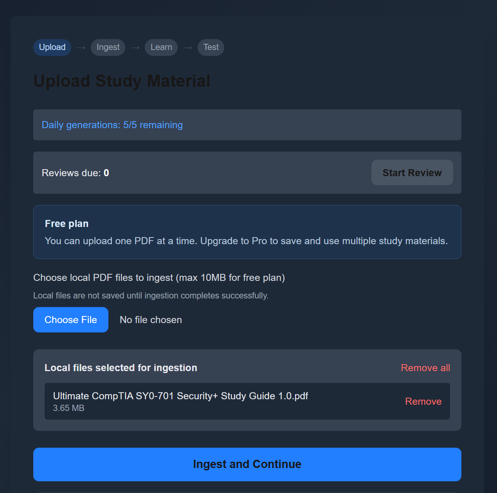
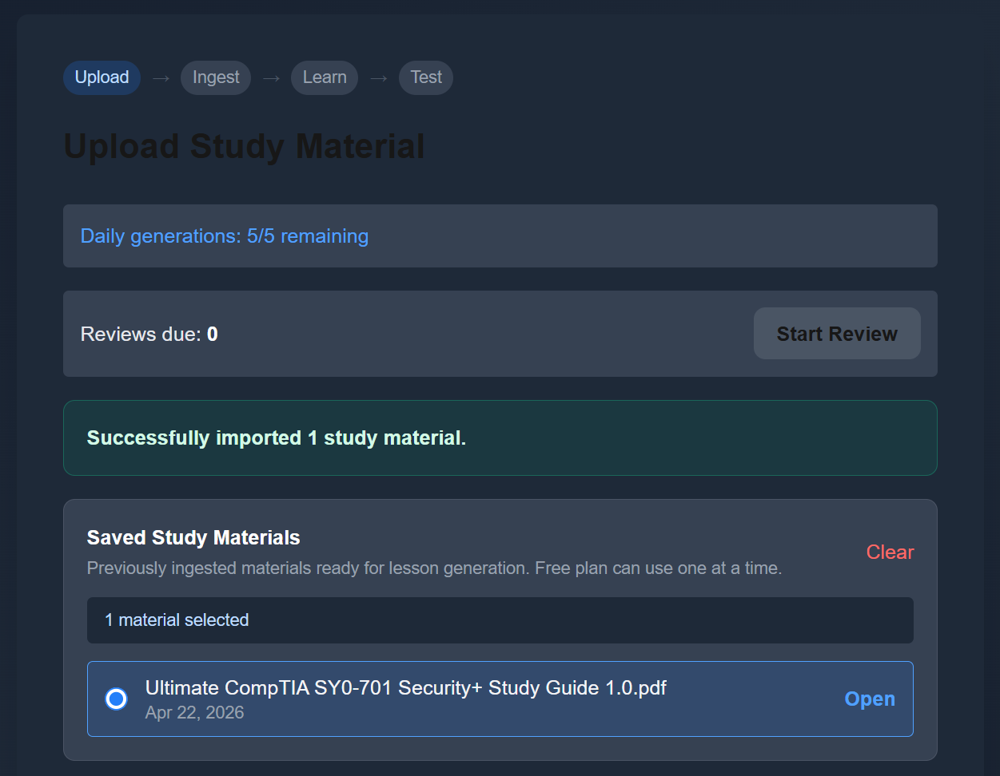
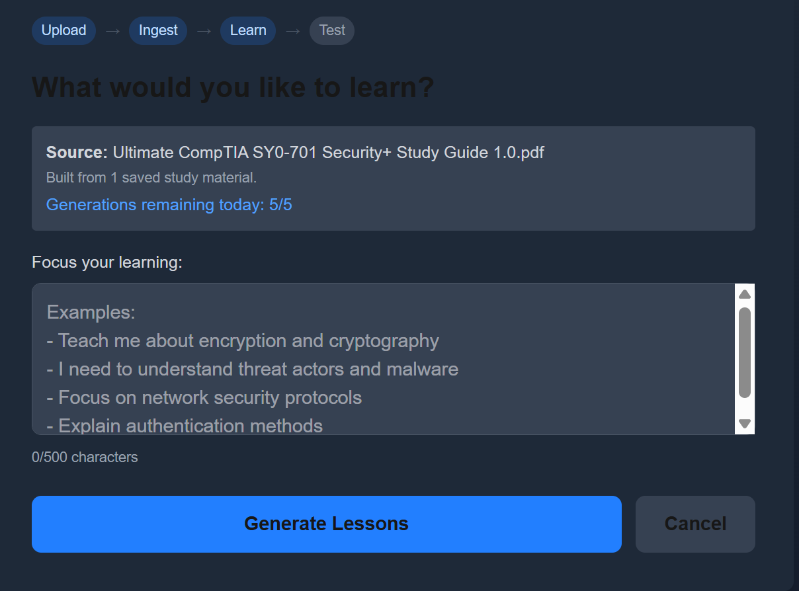
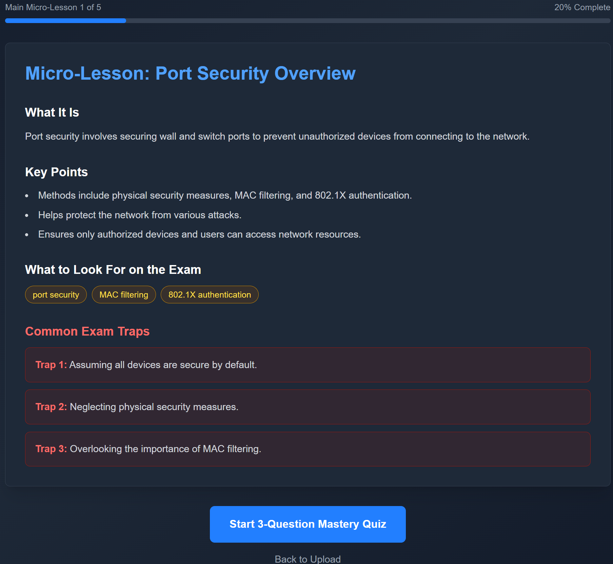
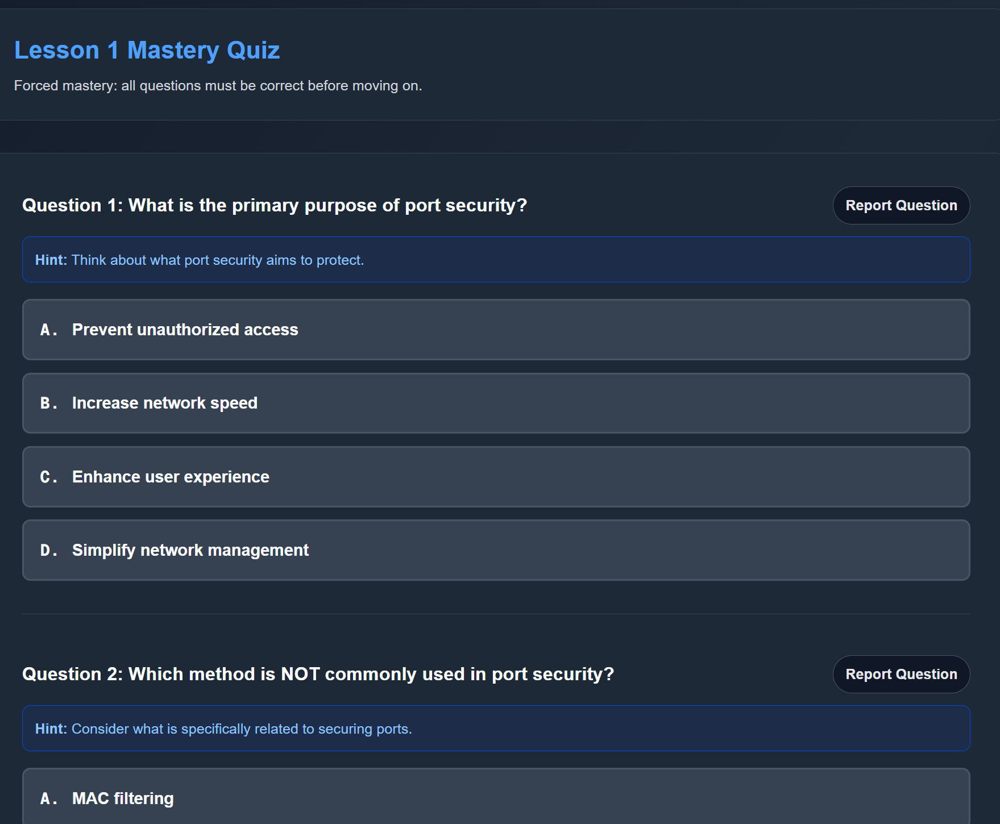
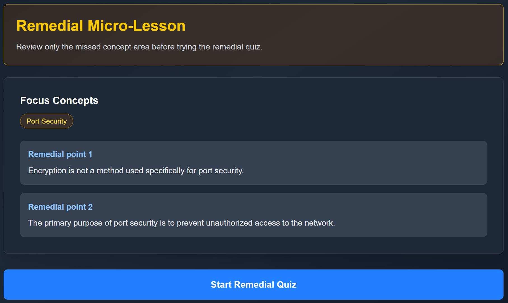
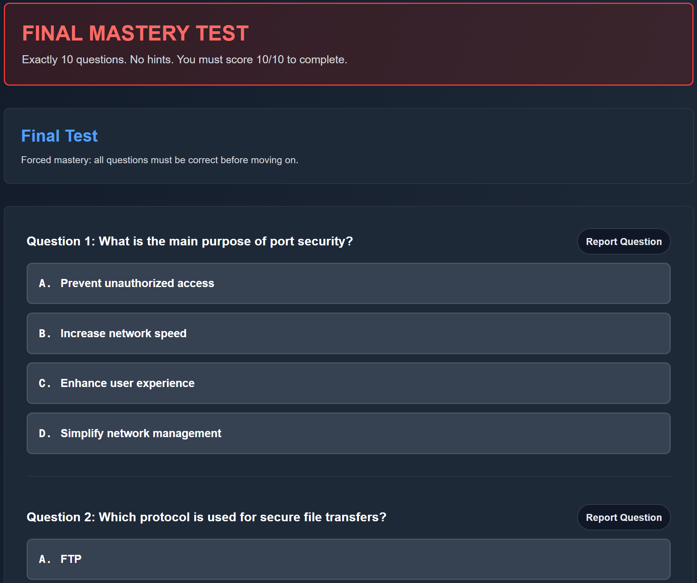
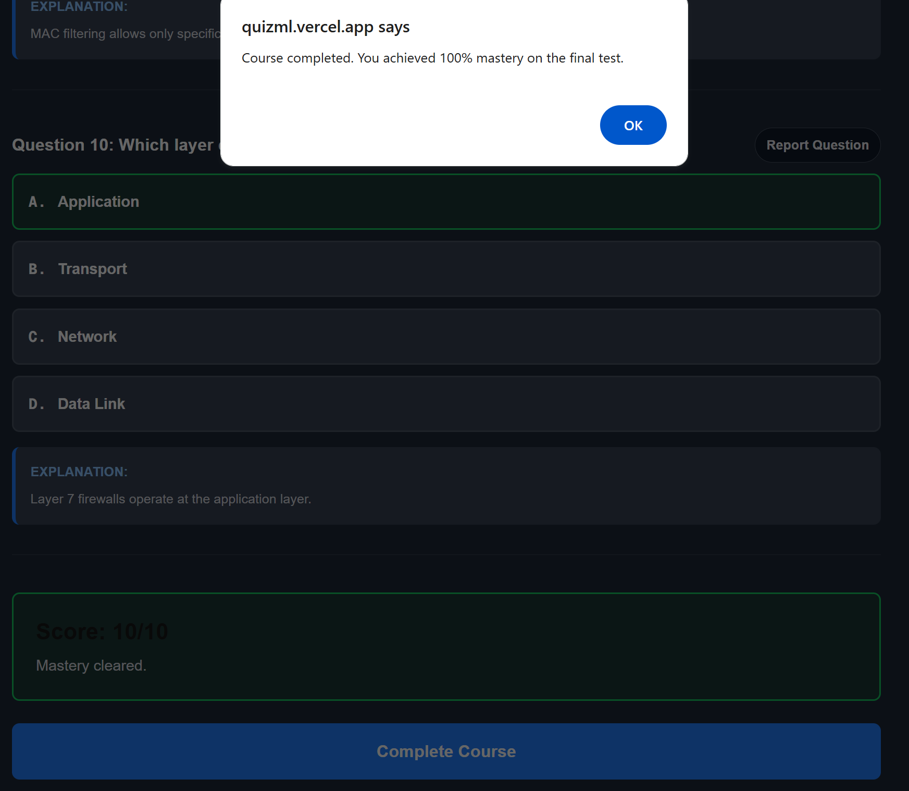

# QuizML.ai

**AI-powered microlearning from your study materials**

Live Demo: https://quizml-49chxx1n8-lyndonstluce-5610s-projects.vercel.app/
Source Code: https://github.com/LyndonYRB/quizml

---

Upload PDFs -> Generate lessons -> Test -> Remediate -> Achieve mastery.

---

## Overview

QuizML.ai is an AI-driven learning platform that transforms raw study materials into structured, interactive micro-learning experiences.

Instead of passively reading PDFs, users:

* Upload study materials
* Generate targeted lessons
* Take mastery-based quizzes
* Receive adaptive remedial learning
* Must achieve **100% mastery** before progressing

This enforces true understanding, not guesswork.

---

## Key Features

### Multi-PDF Ingestion

* Upload one or multiple PDFs based on plan
* Extracts and chunks text intelligently
* Stores materials in Supabase for reuse

### AI-Generated Micro-Lessons

* Converts raw text into:
  * Clear explanations
  * Key points
  * Exam-focused insights
  * Common pitfalls

### Mastery-Based Quizzing

* 3-question quizzes per lesson
* Must answer all correctly to proceed
* Immediate feedback with explanations

### Adaptive Remedial Learning

* Incorrect answers trigger:
  * Focused micro-lessons
  * Targeted concept reinforcement
* Then re-test until mastery

### Final Mastery Test

* 10-question final exam
* No hints
* Requires 10/10 to complete

### Subscription System

* Free vs Pro plan via Stripe
* Pro unlocks:
  * Multiple PDFs
  * Unlimited generations
  * Higher upload limits

---

## Tech Stack

**Frontend**

* Next.js (App Router)
* Tailwind CSS

**Backend**

* Next.js API Routes
* Prisma ORM

**Database**

* Supabase (PostgreSQL + pgvector)

**AI**

* OpenAI (lesson + quiz generation)
* Embeddings for semantic chunking

**Payments**

* Stripe (subscriptions + billing portal)

**Deployment**

* Vercel

---

## Demo Walkthrough

### 1. Upload Study Materials



### 2. Ingestion Success



### 3. Prompt Learning Focus



### 4. AI Micro-Lesson Generated



### 5. Mastery Quiz



### 6. Adaptive Remedial Learning



### 7. Final Mastery Test



### 8. Course Completion (100% Mastery)



---

## How It Works

1. **Upload PDFs**

   * Files are sent to `/api/ingest-materials`
   * Text is extracted and chunked

2. **Embedding + Storage**

   * Each chunk is embedded
   * Stored in `study_material_chunks`

3. **Lesson Generation**

   * User provides a focus prompt
   * Relevant chunks are retrieved
   * AI generates structured lessons

4. **Quiz + Feedback Loop**

   * AI generates questions
   * User must achieve mastery
   * Remedial lessons triggered dynamically

---

## What Makes This Different

Most learning tools:
* Show content
* Give quizzes
* Move on regardless

QuizML:
* Enforces **100% mastery**
* Adapts to mistakes
* Uses your actual materials
* Combines AI + pedagogy

---

## Local Setup

```bash
git clone https://github.com/LyndonYRB/quizml
cd quizml
npm install
```

### Environment Variables

Create a `.env.local` file:

```env
DATABASE_URL=your_supabase_db_url
OPENAI_API_KEY=your_openai_key
NEXT_PUBLIC_SUPABASE_URL=your_supabase_url
NEXT_PUBLIC_SUPABASE_ANON_KEY=your_supabase_anon_key
SUPABASE_SERVICE_ROLE_KEY=your_supabase_service_role_key
STRIPE_SECRET_KEY=sk_test_or_live_...
STRIPE_WEBHOOK_SECRET=whsec_...
STRIPE_PRICE_MONTHLY=price_...
STRIPE_PRICE_YEARLY=price_...
NEXT_PUBLIC_APP_URL=http://localhost:3000
```

---

## Run Locally

```bash
npm run dev
```

Visit:
http://localhost:3000

---

## Stripe Setup

Required environment variables:

```env
STRIPE_SECRET_KEY=sk_live_...
STRIPE_WEBHOOK_SECRET=whsec_...
STRIPE_PRICE_MONTHLY=price_...
STRIPE_PRICE_YEARLY=price_...
NEXT_PUBLIC_APP_URL=https://your-production-domain.com
NEXT_PUBLIC_SUPABASE_URL=...
NEXT_PUBLIC_SUPABASE_ANON_KEY=...
SUPABASE_SERVICE_ROLE_KEY=...
```

Stripe configuration:

* Create two recurring prices:
  * Monthly
  * Yearly
* Set `STRIPE_PRICE_MONTHLY` and `STRIPE_PRICE_YEARLY` to the exact Stripe Price IDs that should grant Pro access.
* Enable the Stripe Billing Portal.
* Use one canonical webhook endpoint in production:
  * `https://your-production-domain.com/api/stripe/webhook`
* Use separate Stripe test-mode webhook endpoints and secrets for Preview and local development.

Subscribe the webhook to these events:

* `checkout.session.completed`
* `customer.subscription.created`
* `customer.subscription.updated`
* `customer.subscription.deleted`
* `invoice.paid`
* `invoice.payment_failed`

Notes:

* The app creates Checkout Sessions and Billing Portal sessions entirely on the server, so `NEXT_PUBLIC_STRIPE_PUBLISHABLE_KEY` is not currently required.
* If a subscription uses a price ID that does not match `STRIPE_PRICE_MONTHLY` or `STRIPE_PRICE_YEARLY`, QuizML will not grant Pro access and will log a diagnostic error so the mismatch is easier to spot.

---

## Deployment

Deployed on Vercel:

```bash
vercel
```

Make sure environment variables are set in the Vercel dashboard with separate values for Production, Preview, and Development where appropriate.

---

## Future Improvements

* Semantic search over PDFs
* Learning analytics dashboard
* Spaced repetition system
* Mobile optimization
* Folder-based material organization

---

## Author

**Lyndon St. Luce**
M.S. Computer Science, Syracuse University

* GitHub: https://github.com/LyndonYRB
* Portfolio: (add link)
* LinkedIn: (add link)

---

## Final Note

This project demonstrates:

* Full-stack development
* AI integration
* Real-world monetization
* Production debugging and iteration

Built to solve a real problem:
Turning passive studying into active mastery.
